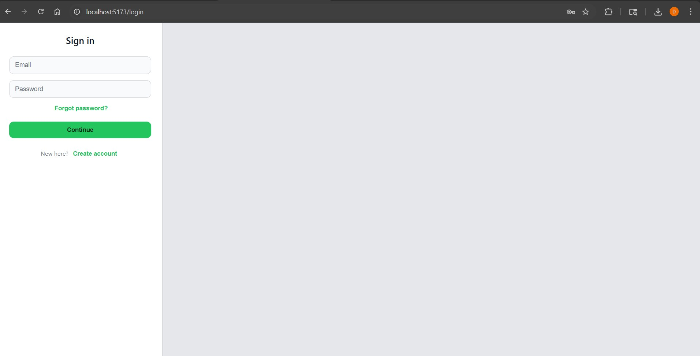
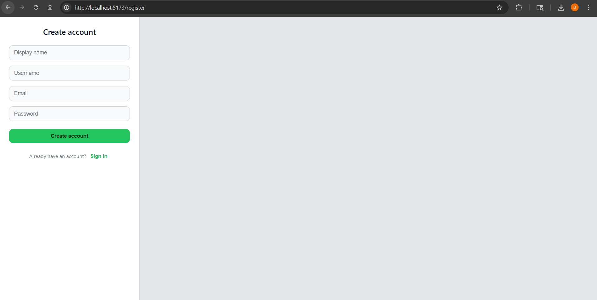
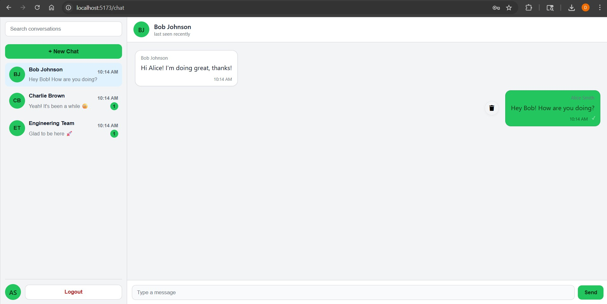

# Client Application – Frontend Architecture

This directory contains the **frontend (client-side)** implementation of the Chat Application.
It is built using **React + Vite** and follows a **modular, scalable architecture**.

---

## Table of Contents
- [Project Overview](#project-overview)
- [Folder Structure](#folder-structure)
  - [Root Level](#root)
  - [src Directory](#src)
- [Routing Overview](#routing-overview)
- [Screenshots](#screenshots)
- [Demo](#-application-demo)
- [Environment Configuration](#environment-configuration)

---

## Project Overview

The client application handles:
- Authentication (login, register, forgot/reset password)
- Real-time chat UI
- Conversation & message state management
- Socket-based messaging
- Offline-first message handling

---

## Folder Structure

### Root
```
client/
├── public/
├── src/
├── .env
├── .env.example
├── Dockerfile
├── eslint.config.js
├── index.html
├── package.json
├── vite.config.js
└── README.md
```

### src
```
src/
├── api/
├── assets/
├── components/
├── constants/
├── db/
├── hooks/
├── strategies/
├── styles/
├── App.jsx
├── main.jsx
├── config.js
├── socket.js
└── index.css
```

---

## src/components

UI building blocks only (no business logic).

- ChatLayout.jsx – Main chat layout
- ConversationHeader.jsx – Active conversation header
- ConversationList.jsx – Conversation sidebar
- MessageFeed.jsx – Message rendering
- MessageInput.jsx – Message composer
- NewChatDialog.jsx – Create new conversation
- LoginPanel.jsx – Login screen
- RegisterPanel.jsx – Registration screen
- ForgotPassword.jsx – Forgot password screen
- ResetPassword.jsx – Reset password screen

---

## src/hooks

Custom hooks encapsulating logic:

- useChatSocket.js – Socket lifecycle & events
- useConversations.js – Conversation state & ordering
- useMessages.js – Message fetching & updates
- useOutbox.js – Offline message queue & retries

---

## src/api
HTTP API abstraction layer.

---

## src/db
Client-side persistence utilities.

- outbox.js – Offline message storage

---

## src/constants
Shared constants (routes, socket events, keys).

---

## src/strategies
Pluggable logic patterns (retry, delivery, extensions).

---

## src/styles
Global and component-level styles.

---

## Routing Overview

| Route | Description |
|------|------------|
| /login | Login |
| /register | Register |
| /forgot-password | Forgot password |
| /chat | Chat interface |


---

## Screenshots

Login Page:



Registration page:



Chat Layout Page:



----

## 🎥 Application Demo

<p>
👉 <strong>YouTube Demo: </strong>
<a href="https://youtu.be/QDdg1_k-M5w" target="_blank">
Click the link to watch the 1-minute demo
</a>
</p>


## Environment Configuration

Create `.env` using `.env.example`:

```
VITE_API_BASE_URL=http://localhost:4000
VITE_SOCKET_URL=http://localhost:4000
```

